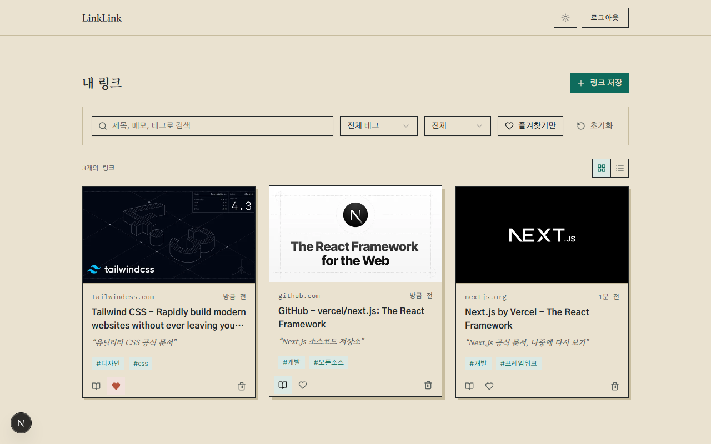
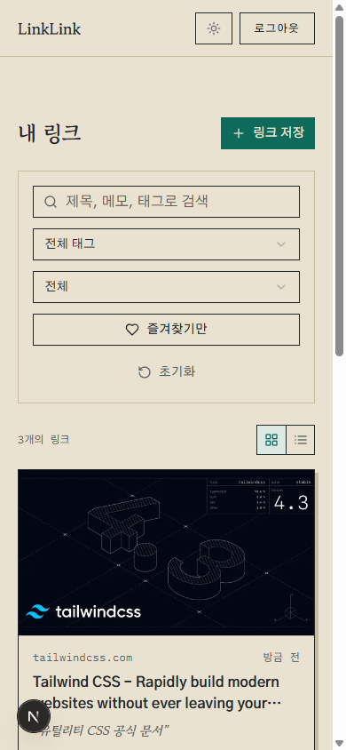
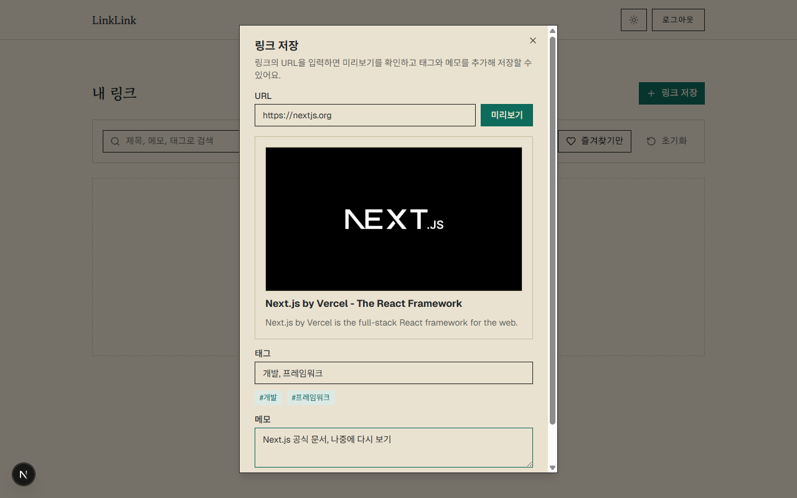

# LinkLink

흩어진 링크를 한곳에 저장하고, 태그·메모·읽음 상태로 다시 찾을 수 있게 해주는 1인 사용자용 링크 아카이브 서비스.

**[linklink-zeta.vercel.app](https://linklink-zeta.vercel.app/)**

<p align="center">
  
  
</p>
<p align="center">
  
</p>

## 핵심 기능

- 링크 저장 시 OG 메타데이터(제목/설명/썸네일) 자동 수집, 실패 시 수동 입력
- 태그·메모 추가
- 읽음/안읽음, 즐겨찾기 토글
- 제목·메모·태그 텍스트 검색 + 태그/읽음상태/즐겨찾기 조합 필터
- 이메일 기반 회원가입/로그인/로그아웃, 비밀번호 재설정 (Supabase Auth)
- 라이트/다크 테마, PWA 설치 지원

## 기술 스택

- Next.js (App Router) + React 19 + TypeScript
- Tailwind CSS v4 + shadcn/ui
- Supabase (Auth, Database)
- open-graph-scraper (메타데이터 수집)

## 로컬 개발

```bash
npm install
cp .env.example .env.local  # NEXT_PUBLIC_SUPABASE_URL, NEXT_PUBLIC_SUPABASE_PUBLISHABLE_KEY 입력
npm run dev
```

[localhost:3000](http://localhost:3000)에서 확인.

## 배포

[Vercel](https://linklink-zeta.vercel.app/)에 배포하며, 환경변수는 `.env.example`과 동일한 두 개(`NEXT_PUBLIC_SUPABASE_URL`, `NEXT_PUBLIC_SUPABASE_PUBLISHABLE_KEY`)만 필요하다.
